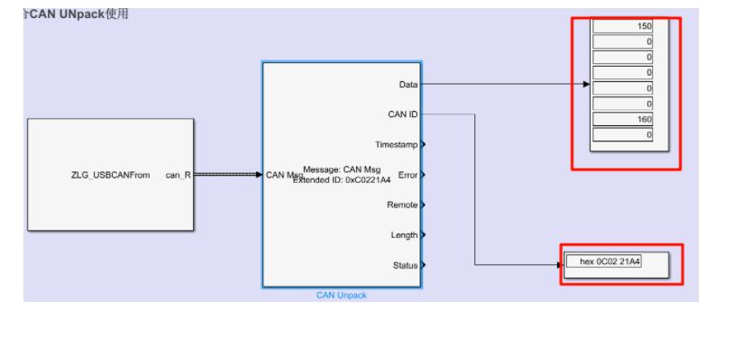
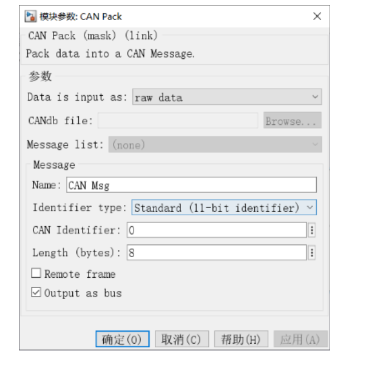
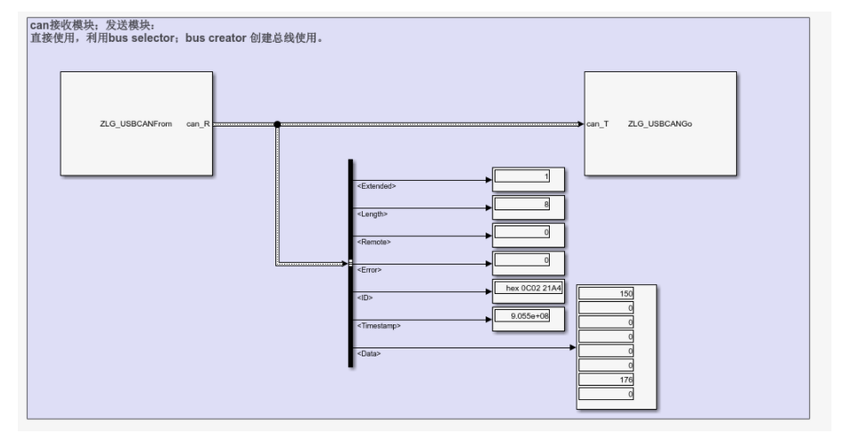

# ZLG USBCAN-Ⅱblock

**Abstract:**  
使用周立功的接口做一个USBCAN驱动模块，能够实现模型仿真期间驱动can盒，实现接收和发送can报文。  

## **库的下载和安装**
直接下载ZLG—USBCAN.mltbx文件，把ZLG—USBCAN.mltbx文件拖拽到matlab命令窗口，安装完成。
或者下载源文件，里面也有这个文件。

**附加功能管理器，可以查看安装的工具箱：**

**打开一个simulink空白模型，打开库模块库，右键后点击“刷新浏览库”，查看新添加了一个库“USB CAN2”，表示工具箱安装成功。**

## 库的使用
在空白模型中添加USB CAN2库里的相应模块到模型中，并且设置参数：  
**DeviceType（设备编号）：USBCAN-Ⅱ（4）；** 默认4

**Deviceind(通道号）**：0 or 1 （0代表第一个can接口）；

**ID（can报文ID）：** 0x00000000（十六进制格式，扩展帧；默认代表接收所有报文）；
目前仅支持扩展帧ID，并且需要填入十六进制格式，当采用默认值0时，则会随机显示所有采集报文中的一个ID报文。
建议根据集体收集的报文，填入确定的ID。

**BaudRate（波特率）：** 250（默认250K）  
目前仅支持250 500 1000 三种波特率；

**OutputBusName（输出结构体）：** CAN_MESSAGE_BUS（can标准格式）  
在命令行输入 canMessageBusType，即可创建can报文标准格式对象。  
  
模型中可以使用bus selector模块对输出进行选择。具体请看demo。

**Tip:** 其它can设备编号请查询附带资料。ID过滤仅支持填写一个。波特率仅支持250 500 1000。
请采用CAN pack  or CAN UNpack两个模块与can驱动配合使用，一方面方便加载DBC文件；另一方面可以自动解析can结构体。

## Demo模型运行
### **接收CAN报文：** DemoReceive.slx  

模型如下：  
  
ZLG_USBCANFrom参数设置：  
  
CAN Unpack模块参数设置：  
  

**点击运行：**
把硬件连接到计算机，can盒电源指示灯亮起。
运行结果如下，正确识别ID，并且读取出CAN报文。  
  

### **发送CAN报文：** DemoTrainsmit
模型如下：  
  
CAN Pack 参数设置：  
  
ZLG_USBCANGo 参数设置：  
  
注意发送的时候，需要把两个模块的ID写成一样；如果不一样时，将会优先使用can pack里面的CAN Identifier作为发送CAN报文的ID。

### **同时收发CAN报文:** DemoTR
模型如下：  
  
运行之后显示如下：  
  
模型可以驱动设备同时进行收发can报文。

**注意事项**
目前所有开发的功能，只做了简单的测试，功能正常；如果后期遇到bug，会再进行提交修改。

上传的有源码以及说明文档，可以参照进行修改。

